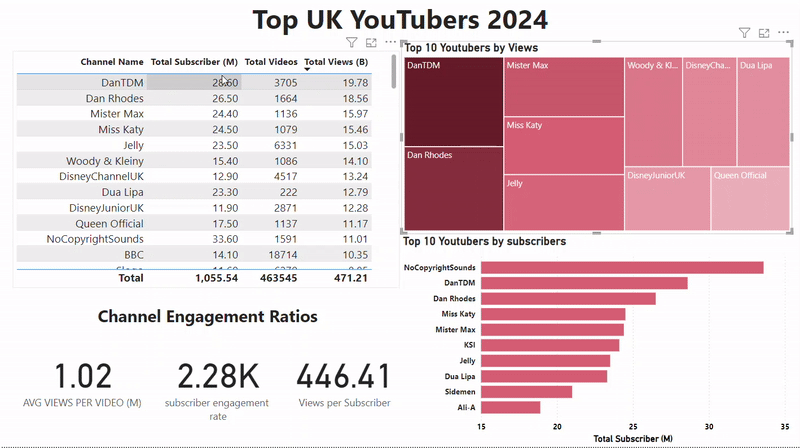
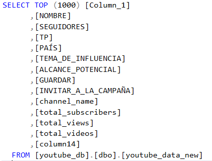
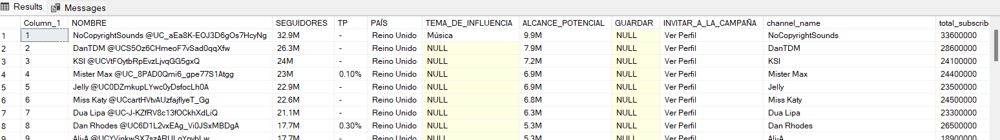
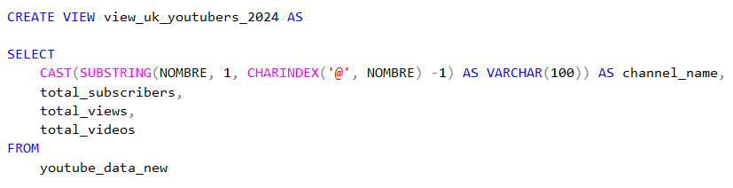
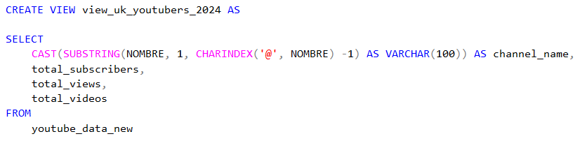
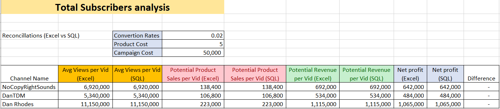

# Selecting marketing campaign abassodor using Excel, SQL and Power Bi

<div align="center">
  
  <p><strong>Dashboard for top UK Youtubers 2024</strong></p>
</div>


# Table of Contents
-  [Objective](#Objective)
-  [Data_Source](#Data_Source)
-  [Steps_involved](#Steps_involved)
 -   [Development_using_SQL](#Development_using_SQL)
 -   [Data_Exploration](##Data_Exploration)
-  [Data_Cleaning](##Data_Cleaning)
  - [Create_SQL_view](##Create_SQL_view)
-  [Testing](#Testing)
-  [Visualization](#Visualization)
  - [Dax_Measures](##Dax_Measures)
  - [Results](##Results)
-  [Findings](#Findings)
-  [Validation](#Validation)
-  [Conclusion](#Conclusion)


# Objective
The Content Strategist wants to identify the most influential YouTube channels in the travel and lifestyle niche to decide which creators would be most impactful for sponsorships and collaborations in 2024.

### Problem Statement

who is the most reliable YouTuber for a company to invest in for effective marketing campaigns?

# Data_Source
Data is sourced from kaggle: (#https://www.kaggle.com/datasets/bhavyadhingra00020/top-100-social-media-influencers-2024-countrywise?resource=download)

# Steps_involved
1. Development using SQL
2. Testing
3. Visualization using Power Bi


# Development_using_SQL

General approach used as follows
-  Get the data
-  Explore the data in Excel
-  Load the data into SQL Server
-  Clean the data with SQL
-  Test the data with SQL and Excel
-  Visualize the data in Power BI
-  Generate the findings based on the insights
-  Write the documentation + commentary
-  Publish the data to GitHub Pages


## Data_Exploration

Dataset contains Top 100 youtubers based on the subscribers count in United Kingdom in 2024
SQL queries are used to explore the data and following is the code used





Data consists of 13 columns and 100 rows 
required columns are channel_name, total_subscribers, total_views, total_videos

## Data Output




## Data_Cleaning

Channel name included name@channel id, data is cleaned in sql to extract only channel id

## Data Cleaning



## Create_SQL_view
Feature engineering is done by selecting only selected columns and created a SQL view to connect it with PowerBi


## SQL View




# Testing

following are the data quality checks conducted
- Row count check
- Column count check
- Data Type check
- Duplicate count check


# Visualization _using_PowerBi
## Dax_Measures

### 1. Total Subscribers (M)


```dax
Total Subscribers (M) =
VAR million = 1000000
VAR sumOfSubscribers = SUM(view_uk_youtubers_2024[total_subscribers])
VAR totalSubscribers = DIVIDE(sumOfSubscribers, million)

RETURN totalSubscribers
```

### 2. Total Views (B)

```dax
Total Views (B) = 
VAR billion = 1000000000
VAR sumOfTotalViews = SUM(view_uk_youtubers_2024[total_views])
VAR totalViews = ROUND(sumOfTotalViews / billion, 2)

RETURN totalViews
```

### 3. Total Videos

```dax
Total Videos = 
VAR totalVideos = SUM(view_uk_youtubers_2024[total_videos])

RETURN totalVideos
```

### 4. Average Views Per Video (M)

```dax
Average Views per Video (M) = 
VAR sumOfTotalViews = SUM(view_uk_youtubers_2024[total_views])
VAR sumOfTotalVideos = SUM(view_uk_youtubers_2024[total_videos])
VAR  avgViewsPerVideo = DIVIDE(sumOfTotalViews,sumOfTotalVideos, BLANK())
VAR finalAvgViewsPerVideo = DIVIDE(avgViewsPerVideo, 1000000, BLANK())

RETURN finalAvgViewsPerVideo 
```

### 5. Subscriber Engagement Rate

```dax
Subscriber Engagement Rate = 
VAR sumOfTotalSubscribers = SUM(view_uk_youtubers_2024[total_subscribers])
VAR sumOfTotalVideos = SUM(view_uk_youtubers_2024[total_videos])
VAR subscriberEngRate = DIVIDE(sumOfTotalSubscribers, sumOfTotalVideos, BLANK())

RETURN subscriberEngRate 

```

### 6. Views per subscriber

```dax
Views Per Subscriber = 
VAR sumOfTotalViews = SUM(view_uk_youtubers_2024[total_views])
VAR sumOfTotalSubscribers = SUM(view_uk_youtubers_2024[total_subscribers])
VAR viewsPerSubscriber = DIVIDE(sumOfTotalViews, sumOfTotalSubscribers, BLANK())

RETURN viewsPerSubscriber
```

# Results

## PowerBi Results

<p align="center">
  
</p>


# Findings

Lets assume hypothetically that all the youtubers charge the same amount for campaining and also I assumed same viewer to sales conversion rate to all youtubers
conversion rate = 2%
Product cost = $5
Campaign cost = $50,000

## Calculation Example

### Youtubers with the most subscribers

1. **NoCopyrightSounds**
   - Average views per video = 6.92 million
   - Product cost = $5
   - Potential units sold per video = 6.92 million x 2% conversion rate = 138,400 units sold
   - Potential revenue per video = 138,400 x $5 = $692,000
   - Campaign cost (one-time fee) = $50,000
   - **Net profit = $692,000 - $50,000 = $642,000**

### Compared returns on top 3 subscribed youtubers

<p align="center">
  
</p>

### Compared returns on top 3 youtubers based on videos

<p align="center">
  
</p>

### Compared returns on top 3 most viewed youtubers

<p align="center">
  
</p>

# Validation

Data is validated using Excel where I compared the results of Excel and SQL and can see that results from excel and SQL are matching with no errors

<p align="center">
  
</p>

# Conclusion

Top Performers by Net Profit:

- Based on Views: "Mister Max" leads with a net profit of 1,276,000, followed by "Dan Rhodes" and "DanTDM."
- Based on Videos: "Dan Rhodes" has the highest net profit (1,065,000), followed by "NoCopyrightSounds" and "DanTDM."
- Based on Subscribers: "Dan Rhodes" maintains the top position, highlighting consistent profitability across metrics.


Focus your marketing campaign on "Dan Rhodes", as she delivers the highest net profit and considerable safe side in all the categories, ensuring maximum impact and return on investment.


